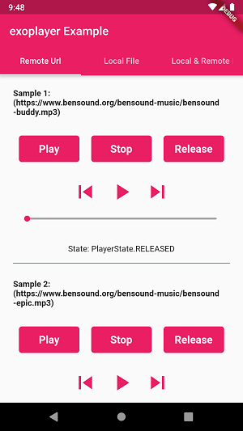
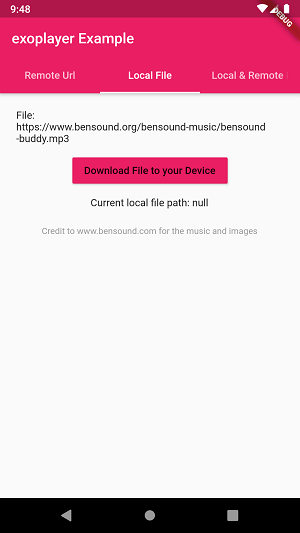
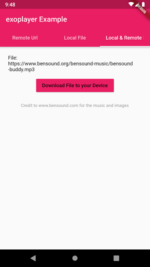
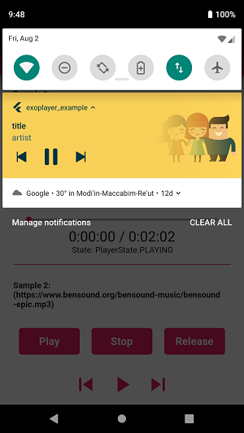

# Flutter_exoplayer

A Flutter plugin that let's you play multiple audio files simultaneously with an option to choose if to play in background or as a forground service, for now works only for Android.

   

## Why pick us

Flutter_exoplayer uses the Java ExoPlayer library, which unlike Android's MediaPlayer offers fast audio buffering, especially when using playlists.
All thanks to the ExoPlayer's `ConcatenatingMediaSource` that let's you use an audio list that allways buffers the next audios. This feature 
of the ExoPlayer let's you play playlists very smoothly. 

Moreover Flutter_exoplayer offers many features such as: 

* Providing realtime player states (PLAYING, PAUSED, STOPPED, RELEASED etc'). 
* Run unlimited count of audios simultaneously. 
* Providing audio Session ID for visualizers.
* It has 2 options for audio playing:
  * Foreground - plays the audio in foreground service so Android won't kill the service when app is in background.
  * Background - plays the audio in background (Android can easily kill the service when app is in background), the main use of this option is when app is in foreground.
* Providing streams such as: current player position, player duration, current player index, player state etc`.

In addition this library is only in it's first steps, any new feature suggestions or bug reports are allways welcome (just submit an issue/PR in my [repository](https://github.com/danielR2001/flutter_exoplayer)), only in this way we can make this library better!


## Install

just add this dependency in your pubsec.yaml file:

```yaml
  dependencies:
    flutter_exoplayer: ^0.5.2
```

## Support us

If you find a bug or a feature you want to be added to this library go to the github repository [Github](https://github.com/danielR2001/flutter_exoplayer), there you can add a new issue and tell us about the bug/feature, and if you think you can fix/add by yourself I would love to get a PR from you. 

## Usage

An `AudioPlayer` instance can play a single audio at a time. To create it, simply call the constructor:

```dart
  AudioPlayer audioPlayer = AudioPlayer();
```

You can create multiple instances to play audio simultaneously, but only if you choose `playerMode: PlayerMode.BACKGROUND`, because android can't run two similar services.

For all methods that return a `Future<Result>`: that's the status of the operation (Result is an enum which contains 3 options: SUCCESS, FAIL and ERROR). If `SUCCESS`, the operation was successful, If `FAIL`, you tried to call audio conrolling methods on released audio player (this status is never returned when calling `play` or `playAll`). Otherwise it's the platform native ERROR code.

Logs are disable by default! To debug, run:

```dart
  AudioPlayer.logEnabled = true;
```

### Playing Audio

To play audio you have two options:
1. play single audio.
2. play playlist.

* play single audio.

```dart
  String url = "URL";
  audioPlayer.play(url);
```

* play playlist.

```dart
  List<String> urls = ["URL1","URL2","URL3"];
  audioPlayer.playAll(urls);
```

The url you pass can be either local direction or network url.

By default the player is set to play in background (Android system can easily kill the Audio player when app is in background), if Player mode is set to FOREGROUND then you need to also pass `audioObject` instance for the foreground notification, respectAudioFocus is set to false (if your app is respectiong audio focus it will pause when other app get's audio focus and duck if other app getting temporary access of audio focus), repeatMode is also set by default to false (every audio source will play only once), by default the volume is set to max (1.0), the index of the audio that you you want to start with by default is set to 0. To change one or more of this parameters you need to just pass them to play method.

```dart
  final Result result = await audioPlayer.play(url,
      repeatMode: true,
      respectAudioFocus: true,
      playerMode: PlayerMode.FOREGROUND,
      audioObject: audioObject);
  if (result == Result.ERROR) {
    print("something went wrong in play method :(");
  }
```

```dart
  final Result result = await audioPlayer.playAll(urls,
      repeatMode: true,
      respectAudioFocus: true,
      playerMode: PlayerMode.FOREGROUND,
      audioObjects: audioObjects);
  if (result == Result.ERROR) {
    print("something went wrong in playAll method :(");
  }
```

### Controlling


After you call play you can control you audio with pause, resume, stop, release, next, previous and seek methods.

* Pause: Will pause your audio and keep the position.

```dart
  final Result result = await audioPlayer.pause();
  if (result == Result.FAIL) {
    print(
        "you tried to call audio conrolling methods on released audio player :(");
  } else if (result == Result.ERROR) {
    print("something went wrong in pause :(");
  }
```

* Resume: Will resume your audio from the exact position it was paused on.

```dart
  final Result result = await audioPlayer.resume();
  if (result == Result.FAIL) {
    print(
        "you tried to call audio conrolling methods on released audio player :(");
  } else if (result == Result.ERROR) {
    print("something went wrong in resume :(");
  }
```

* Stop: Will stop your audio and restart it position.

```dart
  final Result result = await audioPlayer.stop();
  if (result == Result.FAIL) {
    print(
        "you tried to call audio conrolling methods on released audio player :(");
  } else if (result == Result.ERROR) {
    print("something went wrong in stop :(");
  } 
```

* Release: Will release your audio source from the player (you need to call play again).

```dart
  final Result result = await audioPlayer.release();
  if (result == Result.FAIL) {
    print(
        "you tried to call audio conrolling methods on released audio player :(");
  } else if (result == Result.ERROR) {
    print("something went wrong in release :(");
  }
```

* Next: Will play the next song in the playlist or if playing single audio it will restart the current.

```dart
  final Result result = await audioPlayer.next();
  if (result == Result.FAIL) {
    print(
        "you tried to call audio conrolling methods on released audio player :(");
  } else if (result == Result.ERROR) {
    print("something went wrong in next :(");
  }
```

* Previous: Will play the previous song in the playlist or if playing single audio it will restart the current.

```dart
  final Result result = await audioPlayer.previous();
  if (result == Result.FAIL) {
    print(
        "you tried to call audio conrolling methods on released audio player :(");
  } else if (result == Result.ERROR) {
    print("something went wrong in previous :(");
  }
```

* seekPosition: Will seek to the position you set.

```dart
  final Result result = await audioPlayer.seekPosition(_duration));
  if (result == Result.FAIL) {
    print(
        "you tried to call audio conrolling methods on released audio player :(");
  } else if (result == Result.ERROR) {
    print("something went wrong in seek :(");
  }
```

* seekIndex: Will seek to the index in the playlist you set.

```dart
  final Result result = await audioPlayer.seekIndex(index));
  if (result == Result.FAIL) {
    print(
        "you tried to call audio conrolling methods on released audio player :(");
  } else if (result == Result.ERROR) {
    print("something went wrong in seekIndex :(");
  }
```

### Notification Customization

When playing in `PlayerMode.FOREGROUND` then the player will show foreground notification, You can customize it in the `AudioObject` thing like priority/ background color / what actions to show and etc'. 

`NotificationDefaultActions` represents the actions you want to show with your notification (previous, play/pause, next), you have the option to choose between: NONE - only play/pause, PREVIOUS - previous and play/pause, NEXT - next and play/pause, and ALL - that include all actions.

`NotificationCustomActions` represents the custom actions you want to show with your notification (like, download etc'), you have the option to choose between: DISABLED - show no custom icons, ONE - show one custom icon, TWO - show two custom icons. The callback of this actions is returned via `onNotificationActionCallback` (CUSTOM1 is the left action, as CUSTOM2 is the right action). If you chose ONE\TWO  you have to provide the resource for
the icon inside APP_NAME\android\app\src\main\res\drawable, the resource needs to be vector image. The names of the files need to be: "ic_custom1" for
the left custom action and "ic_custom2" for the right action.

Attention! If you choose to show the custom actions you have to follow the instructions above! the file names needs to be as the instructions say and their location too.

`NotificationActionCallbackMode` is a mode that lets you choose between two options: DEFAULT or CUSTOM,
this parameter decides if you will recieve action callback (`CUSTOM`) or not (`DEFAULT`) when user taps on the action via `onNotificationActionCallback` stream, and then you can make custom action for your taste. If set to
`DEFAULT` then the action will do only as the action name says (PLAY -> play, PREVIOUS -> play previous etc`).

Attention! You need to place your app icon or the icon you want to show in the APP_NAME\android\app\src\main\res\drawable folder (you can drop multiple icons there), if you won`t do so your app will crash because android require a small icon for notification.

```dart
  AudioObject audioObject = AudioObject(
      smallIconFileName: "your icon file name",
      title: "title",
      subTitle: "artist",
      largeIconUrl: "local or network image url",
      isLocal: false,
      notificationDefaultActions: NotificationDefaultActions.ALL,
      notificationCustomActions: NotificationCustomActions.TWO,
      );
```

### Streams

The AudioPlayer supports subscribing to events like so:

#### Duration Event

This event returns the duration of the file, when it's available (it might take a while because it's being downloaded or buffered).

```dart
  audioPlayer.onDurationChanged.listen((Duration d) {
    print('Max duration: $d');
    setState(() => duration = d);
  });
```

#### Position Event

This Event updates the current position of the audio. You can use it to make a progress bar, for instance.

```dart
  audioPlayer.onAudioPositionChanged.listen((Duration  p) {
    print('Current position: $p');
    setState(() => position = p);
  });
```

#### State Event

This Event returns the current player state. You can use it to show if player playing, or stopped, or paused.

```dart
  audioPlayer.onPlayerStateChanged.listen((PlayerState s) {
    print('Current player state: $s');
    setState(() => plaVyerState = s);
  });
```

#### Completion Event

This Event is called when the audio finishes playing (in playAll mode it fires only when all playlist finishes playing).
If `repeatMode` is set yo true then this event is never fired. It does not fire when you interrupt the audio with pause or stop.
`COMPLETED` state acts just like `PAUSED` state with seek to the first audio and position 0, and can restart the audio player 
with resume/play/playAll.

```dart
  audioPlayer.onPlayerCompletion.listen((event) {
    print('Current player is completed');
  });
```

#### Audio Session ID Event

This Event is called when audio session id is changed.

```dart
  audioPlayer.onAudioSessionIdChange.listen((audioSessionId) {
      print("audio Session Id: $audioSessionId");
  });
```

#### Notification Action Event

This Event is called when the user taps on one of the notification actions, then the stream will
return the action name of the action that the user has clicked on.

```dart
  audioPlayer.onNotificationActionCallback.listen((notificationActionName) {
    //do something
  });
```

#### Audio Index Event

This Event is called when the current player audio index is changed (new audio is being played).

```dart
  audioPlayer.onCurrentAudioIndexChanged.listen((index) {
      setState(() {
        currentIndex = index;
      });
    });
```

#### Error Event

This is called when an unexpected ERROR is thrown in the native code.

```dart
  audioPlayer.onPlayerError.listen((msg) {
    print('audioPlayer ERROR : $msg');
    setState(() {
      playerState = PlayerState.stopped;
      duration = Duration(seconds: 0);
      position = Duration(seconds: 0);
    });
  });
```

## Supported Formats

You can check a list of supported formats below:

 - [Android](https://exoplayer.dev/supported-formats.html)

## IOS implementation

If you have the time and want to implement this library on IOS, i would love to get PR, and hopefully add your PR to my library.

## Credits

This project was originally a fork of [luanpotter's audioplayers](https://github.com/luanpotter/audioplayers) that was also originally a fork of [rxlabz's audioplayer](https://github.com/rxlabz/audioplayer), but since we have diverged and added more features.

Thanks for @rxlabz and @luanpotter for the amazing work!
